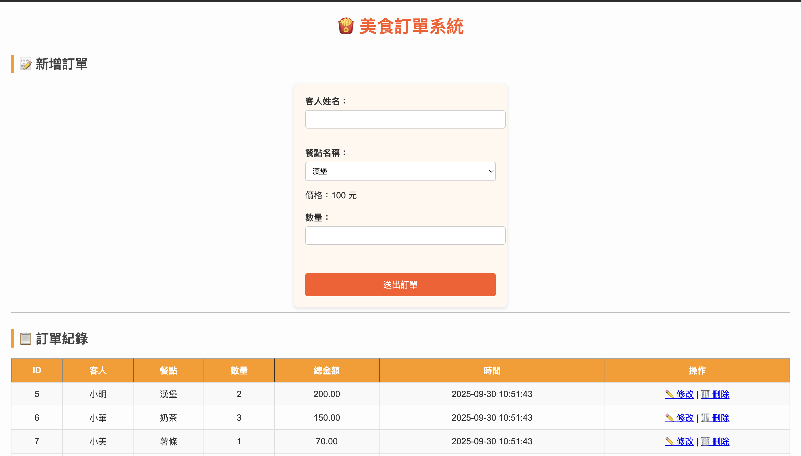
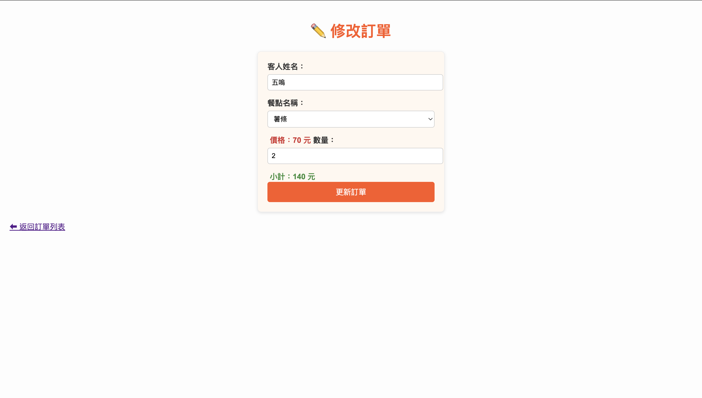
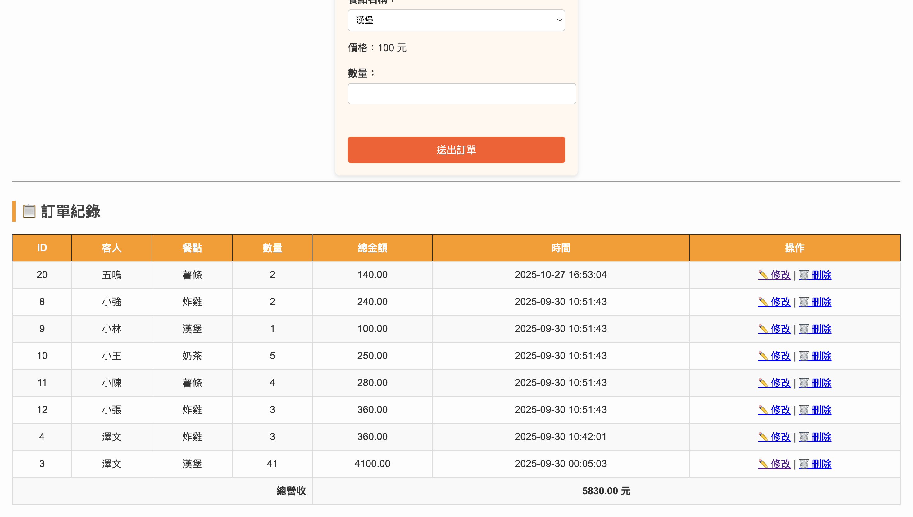

# 1141 Database

- 姓名：廖振廷  
- 學號：41271126H  
- 系級：科技116  

---

## 🧭 Assignment Overview
> Click each item to expand the details 👇

---

<details>
<summary>📘 HW1: Food Ordering System (Flask + MySQL)</summary>



🎥 **[HW1 Video Demo (Click to Watch)](https://youtu.be/WG6yLcLKp0M)**

---

### 🧩 Key Features

- Add new orders  
- Edit orders  
- Delete orders  
- Display order history  
- Automatically calculate total revenue  

---

### 🧱 Tech Stack

| Category | Technologies |
|---------|--------------|
| Frontend | HTML, CSS, Jinja2 |
| Backend | Flask (Python) |
| Database | MySQL |
| Tools | MySQL Workbench, VS Code |

---

### ⚙️ Setup & Execution

```bash
# 1️⃣ Clone the project
git clone https://github.com/childe0905/11401database.git
cd food_order_system

# 2️⃣ Create a virtual environment
python3 -m venv venv
source venv/bin/activate     # Mac/Linux
venv\Scripts\activate        # Windows

# 3️⃣ Install required packages
pip install -r requirements.txt

# 4️⃣ Run the server
python app.py
```
</details>

---

<details>
<summary>📗 HW2: Advanced Food Ordering System (Flask + MySQL + Enhanced CRUD)</summary>

 

🎬 [HW2 Demo Video (Click to Watch)](https://youtu.be/jl4w44F1gVQ)

### 🧩 Key Features
| Feature | Description |
|--------|-------------|
| ➕ Add Orders | Save new orders to the database |
| ✏️ Edit Orders | Update existing order information |
| ✅ Complete Orders | Mark orders as completed |
| 🗑 Delete Orders | Remove orders from the database |
| 💰 Revenue Summary | Automatically calculate total revenue |

### ⚙️ Project Structure
```bash
food_order_system_v2/
├── app.py                # Main Flask application
├── templates/
│   ├── index.html        # Homepage (display and add orders)
│   ├── edit.html         # Edit order page
│   └── login.html        # Login/Register page (optional)
├── static/
│   └── styles.css        # CSS styles
├── requirements.txt      # Dependency list
└── README_HW2.md         # Documentation file
```
</details>

---

<details>
<summary>📙 HW3: Student Performance Management System (Node.js + MongoDB + Render Deployment)</summary>

#### 🖥 [Live Demo](https://student-performance-mxq9.onrender.com)
#### 🧑‍💻 [Source Code](https://github.com/childe0905/student-performance)
🎬 [HW3 Demo Video (Click to Watch)](https://youtu.be/gFxIUUu6Wcs)


### 🧩 Key Features
| Feature | Description |
|--------|-------------|
| ➕ Add Student Data | Input multiple subject scores |
| 🔍 View Student Scores | Display scores and calculate averages |
| ✏️ Edit Scores | Modify scores directly |
| 🗑 Delete Student | Remove student records |
| 📋 Student List | View all students at a glance |

### 🧱 Tech Stack
| Category | Technologies |
|----------|--------------|
| Frontend | HTML, Tailwind CSS |
| Backend | Node.js, Express |
| Database | MongoDB Atlas |
| Deployment | Render |

</details>

---

<details>
<summary>📝 DataBase System Final Project Proposal</summary>

🎬 **[Final Project Demo Video (Click to Watch)](https://youtu.be/MBxQ7GudyyA)**

</details>

---

<details>
<summary>📙 HW4: Student Performance Management System add the multiple-delete feature </summary>

#### 🖥 [Live Demo](https://student-performance-multiple-delete.onrender.com)
#### 🧑‍💻 [Source Code](https://github.com/childe0905/student-performance-multiple-delete-)
🎬 [HW3 Demo Video (Click to Watch)](https://youtu.be/hrTaUuOpOsU)

</details>

