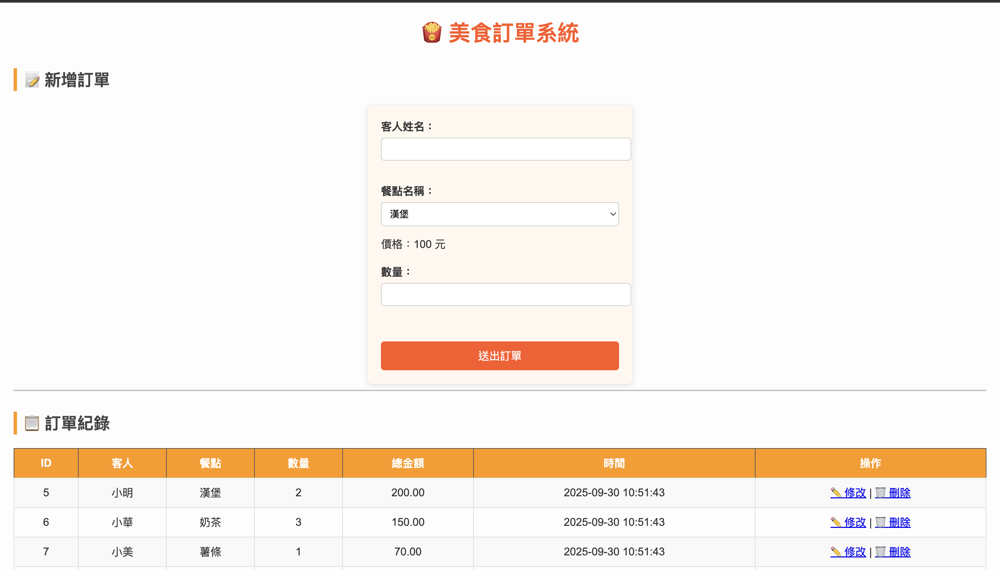

# 1141 Database

- 姓名：廖振廷  
- 學號：41271126H  
- 系級：科技116  

---

## HW1: 🍔 美食訂單系統 (Flask + MySQL)



一個使用 **Flask + MySQL** 開發的簡單點餐系統，支援：
- 新增訂單
- 修改訂單
- 刪除訂單
- 顯示訂單紀錄
- 自動計算總營收

---

### 📦 安裝與執行

1. 下載專案
   ```bash
   git clone https://github.com/childe0905/11401database.git
   cd food_order_system
